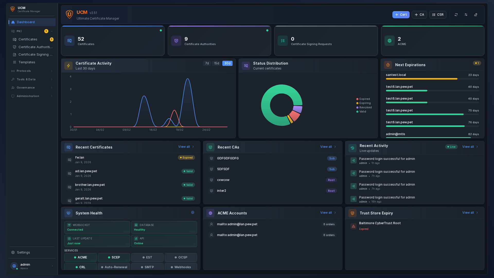

# Ultimate CA Manager


**Ultimate CA Manager (UCM)** is a web-based Certificate Authority management platform with PKI protocol support (SCEP, OCSP, ACME, CRL/CDP), multi-factor authentication, and certificate lifecycle management.



---

## Features

- **CA Management** -- Root and intermediate CAs, hierarchy view, import/export
- **Certificate Lifecycle** -- Issue, sign, revoke, renew, export (PEM, DER, PKCS#12)
- **CSR Management** -- Create, import, sign Certificate Signing Requests
- **Certificate Templates** -- Predefined profiles for server, client, code signing, email
- **Certificate Toolbox** -- SSL checker, CSR/cert decoder, key matcher, format converter
- **Trust Store** -- Manage trusted root CA certificates
- **Chain Repair** -- AKI/SKI-based chain validation with automatic repair scheduler
- **SCEP** -- RFC 8894 device auto-enrollment
- **ACME** -- Let's Encrypt compatible (certbot, acme.sh)
- **OCSP** -- RFC 6960 real-time certificate status
- **CRL/CDP** -- Certificate Revocation List distribution
- **HSM** -- SoftHSM included, PKCS#11, Azure Key Vault, Google Cloud KMS
- **Email Notifications** -- SMTP, customizable HTML/text templates, certificate expiry alerts
- **SSO** -- LDAP, OAuth2 (Azure/Google/GitHub), SAML single sign-on with role mapping
- **Authentication** -- Password, WebAuthn/FIDO2, TOTP 2FA, mTLS, API keys
- **Audit Logs** -- Action logging with integrity verification and remote syslog forwarding
- **Reports & Governance** -- Scheduled reports, certificate policies, approval workflows
- **RBAC** -- 4 system roles (Admin, Operator, Auditor, Viewer) plus custom roles with granular permissions
- **6 Themes** -- 3 color schemes (Gray, Purple Night, Orange Sunset) × Light/Dark
- **i18n** -- 9 languages (EN, FR, DE, ES, IT, PT, UK, ZH, JA)
- **Responsive UI** -- React 18 + Radix UI, mobile-friendly, command palette (Ctrl+K)
- **Real-time** -- WebSocket live updates

---

## Quick Start

### Docker

```bash
docker run -d --restart=unless-stopped \
  --name ucm \
  -p 8443:8443 \
  -v ucm-data:/opt/ucm/data \
  neyslim/ultimate-ca-manager:latest
```

Also available from GitHub Container Registry: `ghcr.io/neyslim/ultimate-ca-manager`

### Debian/Ubuntu

Download the `.deb` package from the [latest release](https://github.com/NeySlim/ultimate-ca-manager/releases/latest):

```bash
sudo dpkg -i ucm_<version>_all.deb
sudo systemctl enable --now ucm
```

### RHEL/Rocky/Fedora

Download the `.rpm` package from the [latest release](https://github.com/NeySlim/ultimate-ca-manager/releases/latest):

```bash
sudo dnf install ./ucm-VERSION-1.noarch.rpm
sudo systemctl enable --now ucm
```

**Access:** `https://localhost:8443` or `https://your-server-fqdn:8443`
**Default credentials:** `admin` / `changeme123` — you will be prompted to change on first login.

See [Installation Guide](docs/installation/README.md) for all methods including Docker Compose and source install.

---

## Documentation

| Resource | Link |
|----------|------|
| Wiki (full docs) | [github.com/NeySlim/ultimate-ca-manager/wiki](https://github.com/NeySlim/ultimate-ca-manager/wiki) |
| Installation | [docs/installation/](docs/installation/README.md) |
| User Guide | [docs/USER_GUIDE.md](docs/USER_GUIDE.md) |
| Admin Guide | [docs/ADMIN_GUIDE.md](docs/ADMIN_GUIDE.md) |
| API Reference | [docs/API_REFERENCE.md](docs/API_REFERENCE.md) |
| OpenAPI Spec | [docs/openapi.yaml](docs/openapi.yaml) |
| Security | [docs/SECURITY.md](docs/SECURITY.md) |
| Upgrade Guide | [UPGRADE.md](UPGRADE.md) |
| Changelog | [CHANGELOG.md](CHANGELOG.md) |

---

## Technology Stack

| Component | Technology |
|-----------|------------|
| Frontend | React 18, Vite, Radix UI, Recharts |
| Backend | Python 3.11+, Flask, SQLAlchemy |
| Database | SQLite (PostgreSQL supported) |
| Server | Gunicorn + gevent WebSocket |
| Crypto | pyOpenSSL, cryptography |
| Auth | Session cookies, WebAuthn/FIDO2, TOTP, mTLS |

---

## File Locations

| Item | Path |
|------|------|
| Application | `/opt/ucm/` |
| Data & DB | `/opt/ucm/data/` |
| Config (DEB/RPM) | `/etc/ucm/ucm.env` |
| Logs (DEB/RPM) | `/var/log/ucm/` |
| Service | `systemctl status ucm` |

Docker: data at `/opt/ucm/data/` (mount as volume), config via environment variables, logs to stdout.

---

## Contributing

1. Fork the repository
2. Create feature branch (`git checkout -b feature/my-feature`)
3. Commit and push
4. Open Pull Request

---

## License

BSD 3-Clause License with Commons Clause -- see [LICENSE](LICENSE).

---

## Support

- [GitHub Issues](https://github.com/NeySlim/ultimate-ca-manager/issues)
- [GitHub Wiki](https://github.com/NeySlim/ultimate-ca-manager/wiki)

